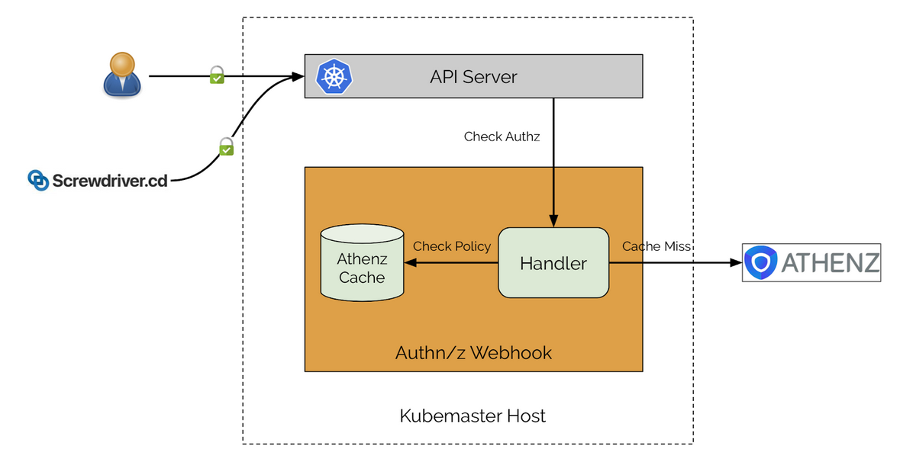

# k8s-athenz-webhook [](https://godoc.org/github.com/yahoo/k8s-athenz-webhook) [](https://travis-ci.org/yahoo/k8s-athenz-webhook) [](https://coveralls.io/github/yahoo/k8s-athenz-webhook?branch=master) [](https://goreportcard.com/report/github.com/yahoo/k8s-athenz-webhook)

An API for a Kubernetes authentication and authorization webhook that integrates with
[Athenz](https://github.com/yahoo/athenz) for access checks. It allows flexible
resource mapping from Kubernetes resources to Athenz.

## Architecture
The diagram below shows the end to end flow of how the webhook integrates into
Kubernetes.


The following steps occur during any access check:
1. The user, pipeline, or service authenticates with the Kubernetes API server
through the use of X.509 certificates or through a ntoken.
2. The authorization check goes to the auth webhook to validate if the user,
service, or pipeline has access.
3. If the caching feature (described further down) is turned on, the webhook
will validate the access check against the Athenz domain data it has stored
in memory.
4. If the caching feature return false or if it's not turned on, the check will
call Athenz.

Note: You can use just the authorization hook without also using the authentication
hook.

### Authentication
There are two ways to authenticate with Athenz, using X.509 certificates or
using ntokens.

#### Ntoken (deprecated)
To use ntokens for clients in the kube config, the auth webhook must be configured
as an authentication endpoint for the Kubernetes API server. The auth webhook
contains a public key cache which has the public keys of Athenz hosts which are
used to validate the ntoken signatures. If there is a cache miss, the webhook will
call Athenz on the principal API endpoint.

#### X.509 (recommended)
The recommended approach for authentication is to attach the Athenz CA to the 
Kubernetes API CA. This will mean clients will specify Athenz certificates for
their connection in the kube config and be authenticated through the use of a
common CA.

### Authorization
Authorization is done by calling Athenz to check if the client has access to the
requested action. Athenz internally will check the client identity against the
role and policies in the domain to verify if the action is allowed. The default
behavior is for the auth webhook to call the Athenz ZTS server on the access
API endpoint and fallback to ZMS if the ZTS calls fail.

#### Caching feature (Alpha)
The auth webhook supports a caching features for authorization which utilizes the
Athenz domain custom resource which are created by the [k8s-athenz-syncer](https://github.com/yahoo/k8s-athenz-syncer).
If this feature is turned on, the webhook will check if the requested action for
the identity is authorized to access the resource by checking against an in memory
cache of Athenz domains. This is a huge performance improvement as network calls
to ZTS / ZMS are avoided and it also allows the webhook to continue running in the
case Athenz servers go down.

**Note**: This feature is currently in alpha mode and is being tested in a dry
run mode. Some edge cases may not be fully covered yet while it's being developed
to be on parity with the access Athenz API.

## Prerequisites
There are a variety of prerequisites required in order to run this controller, they
are specified below.
- **Kubernetes cluster** - A running Kubernetes cluster is required with access to
the control plane. More information on how to setup a cluster can be found in the
official documentation [here](https://kubernetes.io/docs/setup/).
- **Athenz** - Athenz ZTS and ZMS servers must be fully deployed. More information
and setup steps can be found [here](http://www.athenz.io/).
- **Athenz syncer (optional)** - The Athenz syncer must be fully deployed and syncing
Athenz domain data into custom resources for this webhook to watch if using the 
caching feature. The repo can be found [here](https://github.com/yahoo/k8s-athenz-syncer).

## Usage

### Configuring the auth webhook with the Kubernetes API server
To configure the Kubernetes API server to use a custom auth webhook server, follow
the steps defined on their official documentation which can be found
[here](https://kubernetes.io/docs/reference/access-authn-authz/webhook/).

### Implement client library
This repo does not provide a main program that you can run out of the box. See
the following sections for reference implementations that can be customized to
suit your needs. The source code can be found in the [example directory](example).

The primary implementation the client must provide is to create a struct which
implements the ResourceMapper interface.

```
// ResourceMapper allows for mapping from an authorization request to Athenz entities.
type ResourceMapper interface {
	// MapResource maps a subject review spec into a principal and a list of Athenz
	// authz checks at least one of which must succeed. An empty list implies no
	// authorization. An error must be returned if the mapper is not able or
	// unwilling to map the supplied spec into Athenz checks.
	// Returning multiple items allows the implementor to add a secondary
	// authz request for superuser access, for example.
	MapResource(ctx context.Context, spec authz.SubjectAccessReviewSpec) (principal string, checks []AthenzAccessCheck, err error)
}
```

This allows the client to implement authorization checks which are specific to 
their own Athenz to Kubernetes mapping inside of their cluster.

### Examples

#### Simple Client implementation
The sample auth webhook in the example directory provides an implementation
which maps Athenz domains to Kubernetes namespaces using a '.' to '-' and '-'
to '--' conversion. For example, the backend.db domain would translate to the
backend-db namespace.

The example implementation does the following checks.
1. Checks if the users are not part of the denied users list which automatically
are denied such as system:anonymous.
2. Checks if the resources being accessed are part of the denied resource list
such as podsecuritypolicies.
3. If cluster scoped resources are being accessed such as resourcequotas, limitranges,
namespaces then use a separate admin domain to check access.
4. If the action being done is read only access then also check against the admin
domain.
5. Check if the user is allowed the action through the Athenz policy. 

#### Garm implementation
Please see the readme for the garm repo [here](https://github.com/yahoojapan/garm)
to see implementation specific details.

## Contribute

Please refer to the [contributing](Contributing.md) file for information about how to get involved. We welcome issues, questions, and pull requests.

## Maintainers/Contacts
Core Team: omega-core@verizonmedia.com

## License
Copyright 2019 Verizon Media Inc. Licensed under the terms of the 3-Clause BSD License.
